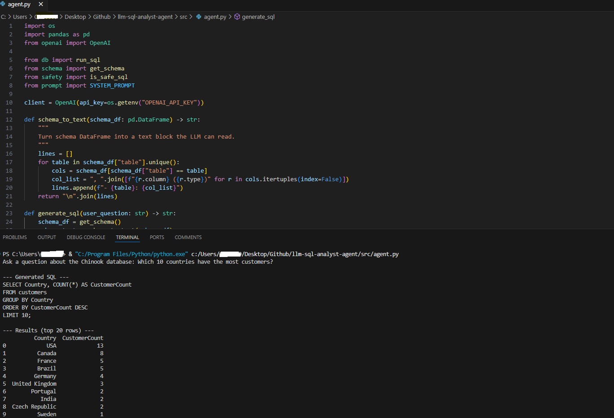

# LLM SQL Analyst Agent

An AI-powered analytics agent that converts natural language questions into safe SQL queries and executes them against a real database.

This project demonstrates how to build a **tool-using LLM agent** with schema grounding, safety guardrails, and real database execution.

---

## 🔍 What This Agent Does

1. Takes a question in plain English  
2. Uses an LLM to generate a SQLite `SELECT` query  
3. Applies safety checks (read-only SQL only)  
4. Executes the query on a real database  
5. Returns results to the user  

**English → SQL → Execute → Results**

---

## 🗄 Dataset

- **Chinook SQLite Database**
- Tables include: customers, invoices, tracks, albums, artists
- Realistic business-style schema used for SQL training and demos

---

## 🧠 Why This Project Matters

This project showcases:
- LLM + tool integration
- Schema-aware SQL generation
- Safety guardrails for AI systems
- Real database analytics (not mock data)
- Enterprise-aware development constraints

---

## 🛠 Tech Stack

- Python
- SQLite
- OpenAI API
- Pandas

---

## 📂 Project Structure
```text
llm-sql-analyst-agent/
├── assets/
│   ├── demo_revenue.png
│   └── demo_customers.png
├── db/
│   └── chinook.db
├── src/
│   ├── agent.py        # LLM → SQL → execute
│   ├── db.py           # SQL execution
│   ├── schema.py       # Schema extraction
│   ├── safety.py       # SQL guardrails
│   └── prompt.py       # LLM instructions
├── README.md
└── requirements.txt
```

---

## ▶️ Demo Screenshots

### Top 10 Countries by Customers


---

## ▶️ How to Run
```bash
python src/agent.py
```

---
